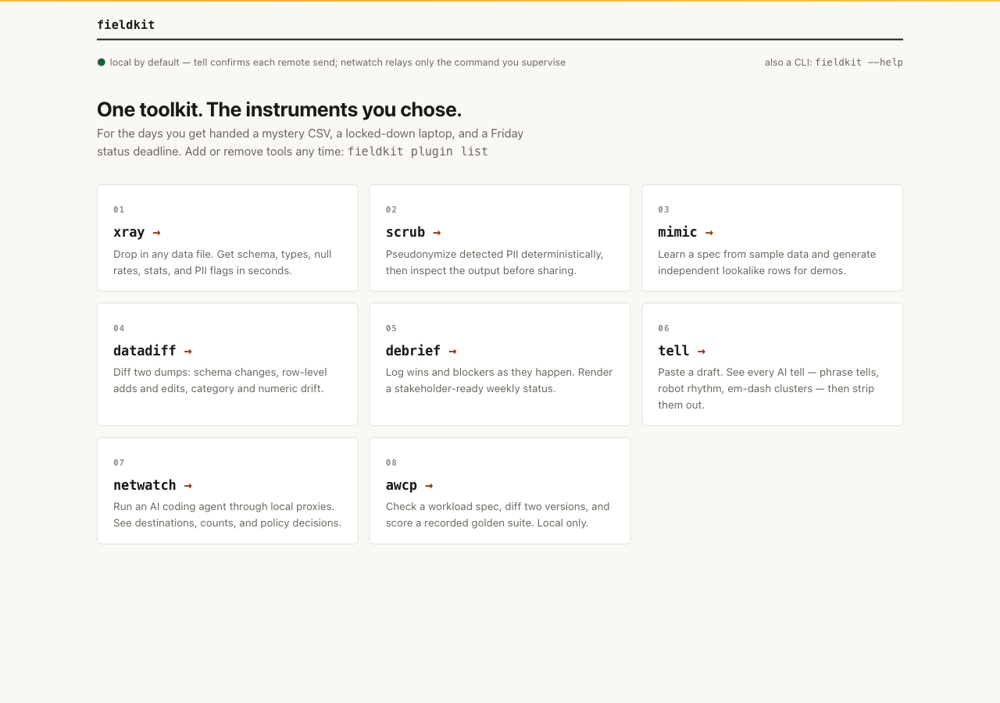
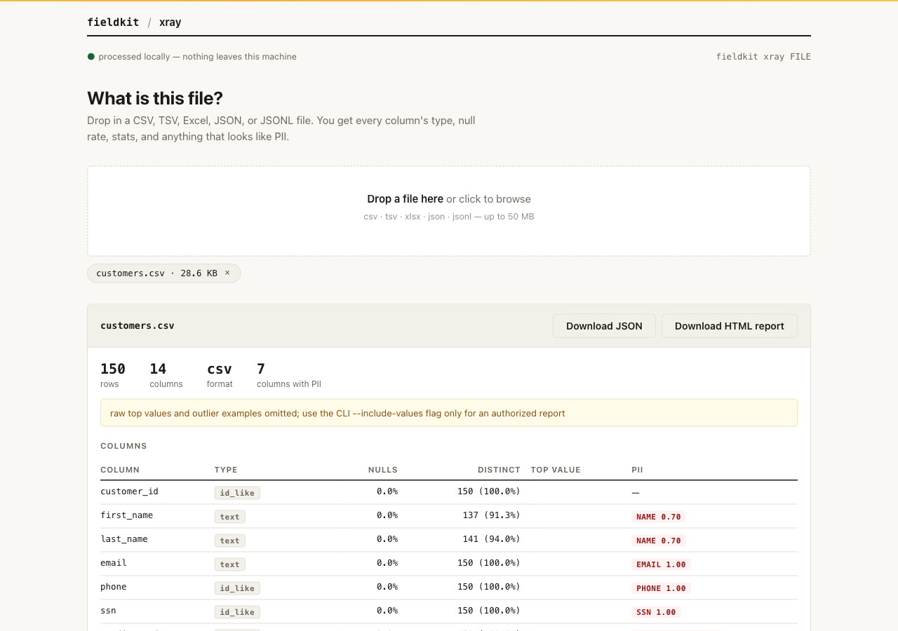
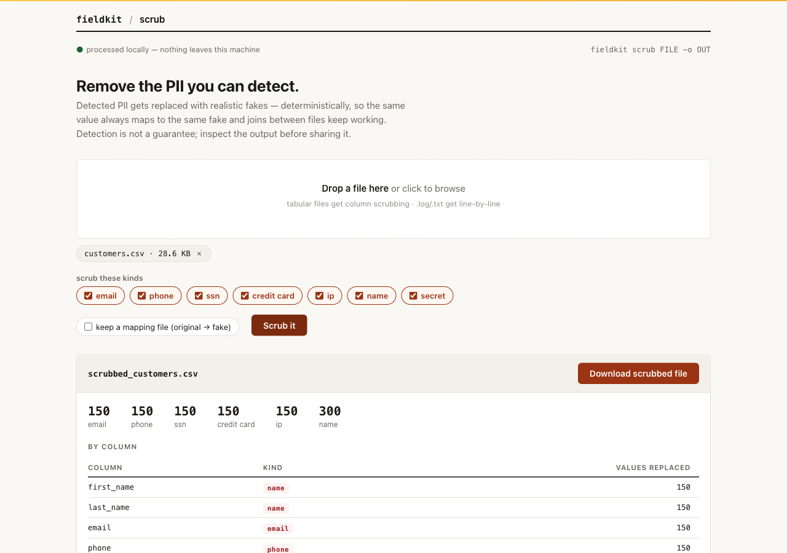
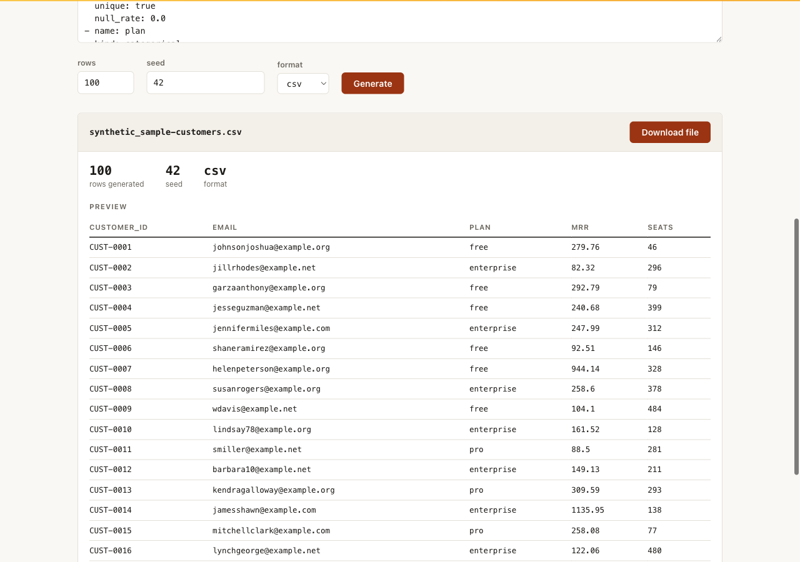
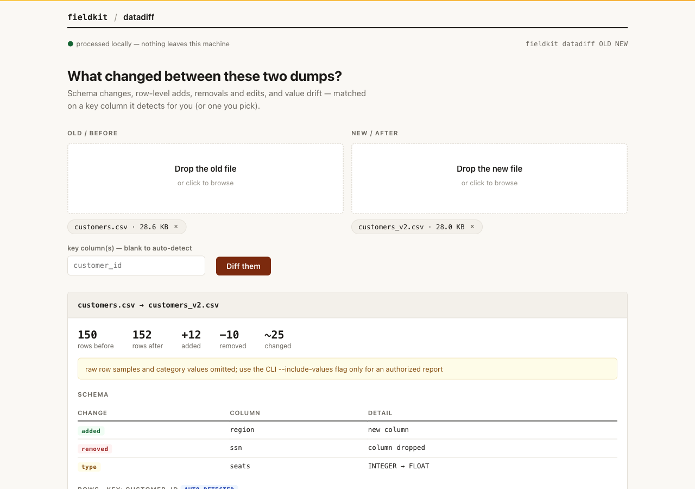
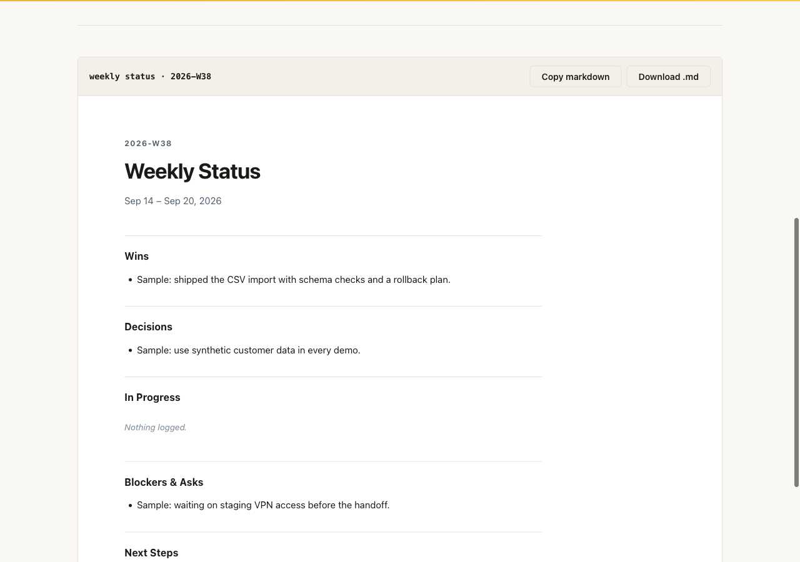
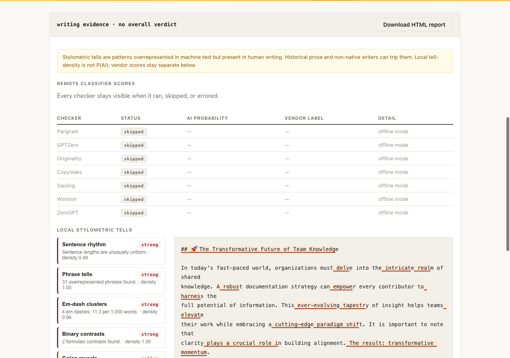
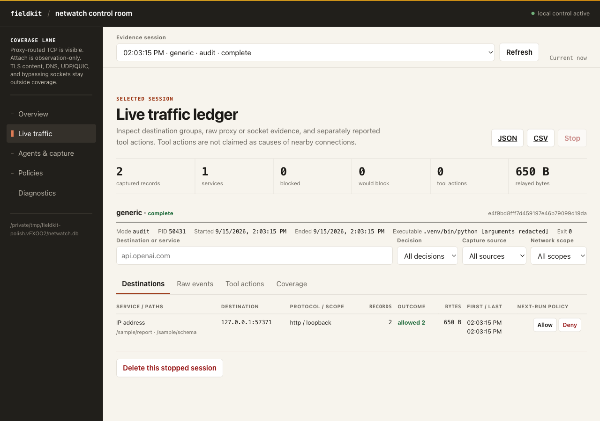
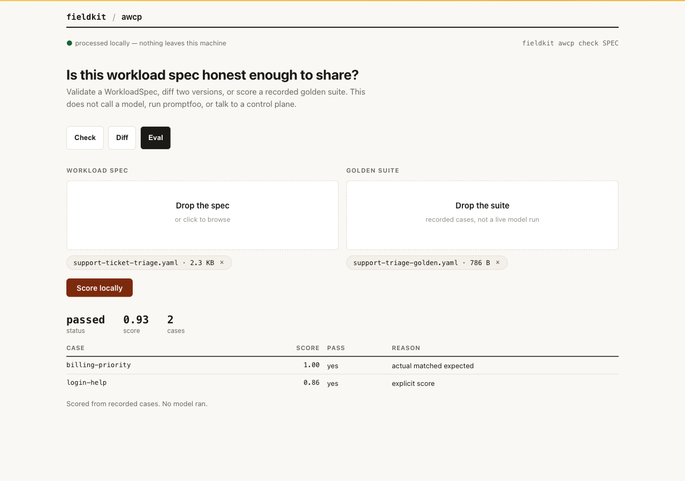

<p align="center">
  <picture>
    <source media="(prefers-color-scheme: dark)" srcset="brand/logo-reversed.svg">
    
  </picture>
</p>

# Field Kit

Local toolkit for forward-deployed engineers. Profile a mystery dump, replace
detected PII, build a demo, explain what changed, write Friday's status, check a
draft, watch where an agent connects, or check an AI workload spec — on your
machine, with no telemetry.

It is built for the days you get handed a mystery CSV, a locked-down laptop, and
a Friday status deadline. Eight tools ship today as plugins. They run locally by
default. Remote text classifiers, model downloads, package installation, and
supervised network relays require the explicit actions described below.

**Not on PyPI yet.** The PyPI project named `fieldkit` is unrelated.
Requires Python 3.12 or newer and [uv](https://docs.astral.sh/uv/). From a checkout of this
repo, or the `v0.2.0` tag:

```
uv sync
uv run fieldkit --help
uv run fieldkit xray examples/customers.csv
```

That one `uv sync` installs the core and all eight plugins, editable. Every
command below is `uv run fieldkit ...`; activate `.venv` if you would rather
drop the prefix. Sample data lives in `examples/`. The included examples are
synthetic.

GitHub wheels: download
[fieldkit-0.2.0-wheels.tar.gz](https://github.com/myrrazor/fde-fieldkit/releases/download/v0.2.0/fieldkit-0.2.0-wheels.tar.gz)
and, in that directory:

```
tar -xzf fieldkit-0.2.0-wheels.tar.gz
uv venv --seed --python 3.12 fresh
uv pip install --python fresh/bin/python wheels/*.whl
fresh/bin/fieldkit --version
```

`wheels/*.whl` selects every Field Kit wheel by path, including the core. Later
plugin adds use `fresh/bin/fieldkit plugin add xray --wheelhouse wheels`. Do
not `pip install fieldkit` from a package index.

Prefer a browser? Start the local hub:

```
uv run fieldkit serve
```

From the wheel installation, use `fresh/bin/fieldkit serve` instead.

It prints the URL. The server binds `127.0.0.1` only — there is no `--host`.
It prefers port 8765; if that port is taken it picks a free port and says so.
`--port 9000` pins a port and exits if that one is busy. Open the printed URL.
Every installed tool gets a drag-and-drop page; tools you have not added show
dimmed with their `plugin add` command. Hostile `Host` headers get 400;
cross-origin writes get 403.

<p>
  <a href="site/assets/screenshots/hub.png">
    
  </a>
</p>

<p><a href="site/assets/screenshots/hub.png">Open full-size hub screenshot</a>. Local hub with all eight tools installed.</p>

[Docs in `site/`](site/docs/index.html)
· [Public site](https://fde-fieldkit.vercel.app/docs/)
· [Brand images](brand/README.md)
· [Release](https://github.com/myrrazor/fde-fieldkit/releases/latest)
· [Contributing](CONTRIBUTING.md)
· [Changelog](CHANGELOG.md)
· [Security](SECURITY.md)
· [Star on GitHub](https://github.com/myrrazor/fde-fieldkit)

Public docs: https://fde-fieldkit.vercel.app. If that host is unreachable, use
the in-repo `site/` tree.

Limits, up front: inputs are capped at 50 MB (`MAX_DATASET_BYTES`); detector
hits are not a guarantee; Netwatch does not see DNS, UDP/QUIC, or sockets that
ignore proxies; awcp never calls a model. Analysis stays local except explicit
`tell check --remote`, Netwatch's supervised relay, package installs, and optional
`--ml` model download.

| tool | what it does |
|---|---|
| **xray** | Profile a file: schema, types, nulls, PII flags |
| **scrub** | Replace detected PII with realistic, joinable fakes |
| **mimic** | Generate seeded demo data from a YAML spec |
| **datadiff** | Explain what changed between two dumps |
| **debrief** | Log wins and blockers, render Friday's status |
| **tell** | Inspect a draft for AI writing tells, locally |
| **netwatch** | See (and optionally gate) where an agent connects |
| **awcp** | Check a workload spec, diff versions, score golden evals |

<details>
<summary>Install from locally built wheels</summary>

```
uv run --locked python scripts/build_release.py dist
uv venv --seed --python 3.12 fresh
uv pip install --python fresh/bin/python dist/fieldkit-0.2.0-py3-none-any.whl
fresh/bin/fieldkit plugin add xray --wheelhouse dist
```

Install Field Kit wheels by path (`wheels/*.whl` from the release bundle, or
named files under `dist/`). `--wheelhouse` does not disable network access
for pandas and other third-party dependencies. It is not a complete offline
bundle. See [docs/RELEASING.md](docs/RELEASING.md) for checksums and the
GitHub Release layout.

</details>

## Sixty seconds with each tool

### xray: what is this file?

```
uv run fieldkit xray examples/customers.csv
uv run fieldkit xray examples/customers.csv --html profile.html
```

<details>
<summary>Sample output</summary>

```
customers.csv · CSV · 150 × 14
┃ column      ┃ type        ┃ nulls % ┃     distinct ┃ top value ┃ PII flags   ┃
│ customer_id │ id_like     │    0.0% │ 150 (100.0%) │ —         │ —           │
│ email       │ text        │    0.0% │ 150 (100.0%) │ —         │ EMAIL 1.00  │
│ ssn         │ id_like     │    0.0% │ 150 (100.0%) │ —         │ SSN 1.00    │
│ notes       │ text        │   24.0% │  114 (76.0%) │ —         │ —           │
```

</details>

<details>
<summary>Local UI (synthetic sample data)</summary>

<p>
  <a href="site/assets/screenshots/xray.png">
    
  </a>
</p>

<p><a href="site/assets/screenshots/xray.png">Open full-size image</a>. Repository example data, not a customer file.</p>

</details>

Schema, inferred types, null rates, distinct counts, and a PII flag with a
confidence for every column. Reads csv, tsv, xlsx, json, and jsonl (UTF-8).
Pass `--fmt` when detection is wrong or the extension is misleading. Parquet and
other columnar formats are not supported. Inputs are capped at 50 MB total
(`MAX_DATASET_BYTES`); larger files fail with an error that names the limit.
`--html` writes a report you can hand over; `--json profile.json` writes the
same thing for machines. Sample values are redacted unless you pass
`--include-values`.

### scrub: take the PII out before you share it

```
uv run fieldkit scrub examples/customers.csv -o customers_safe.csv
uv run fieldkit scrub examples/app.log -o app_safe.log --text
```

<details>
<summary>Sample output</summary>

```
     Replacements
┃ Kind        ┃ Count ┃
│ email       │   150 │
│ phone       │   150 │
│ ssn         │   150 │
│ credit_card │   150 │
│ ip          │   150 │
│ name        │   300 │
```

</details>

<details>
<summary>Local UI (synthetic sample data)</summary>

<p>
  <a href="site/assets/screenshots/scrub.png">
    
  </a>
</p>

<p><a href="site/assets/screenshots/scrub.png">Open full-size image</a>. Repository example data, not a customer file.</p>

</details>

Emails, phones, SSNs, card numbers, IPs, names, and secrets become realistic
fakes. It is deterministic: the same input value always maps to the same fake,
so joins across files still line up. `--text` is line mode for logs.
`--kinds email,phone` narrows it, and `--mapping` writes the reversal key, which
is as sensitive as the original file. Detection is not a guarantee. Common names
can collide with dictionary hits, and free-text notes are only scrubbed where the
scanner finds a match — read the output before you send it.

### mimic: demo data that looks real

```
uv run fieldkit mimic learn examples/customers.csv -o spec.yaml
uv run fieldkit mimic generate spec.yaml -n 10000 --seed 42 -o demo.csv
```

```
wrote spec.yaml
wrote demo.csv (10000 rows)
```

<details>
<summary>Local UI (synthetic sample data)</summary>

<p>
  <a href="site/assets/screenshots/mimic.png">
    
  </a>
</p>

<p><a href="site/assets/screenshots/mimic.png">Open full-size image</a>. Learned from repository example data, not a customer file.</p>

</details>

`learn` writes a plain YAML spec: types, category pools, distributions. Edit it,
then generate as many rows as you need. Same seed, same output. PII columns get
independent fake values, never fingerprints of the source. Learned `unique`
flags for email/phone/ssn/card/ip mirror whether the sample column was unique,
and generation retries to keep that promise. In a hurry, skip the spec:

```
uv run fieldkit mimic generate examples/customers.csv -n 500 -o demo.csv
```

### datadiff: what changed between these dumps?

```
uv run fieldkit datadiff examples/customers.csv examples/customers_v2.csv
```

<details>
<summary>Sample output</summary>

```
customers.csv (150 rows) → customers_v2.csv (152 rows)
┃ change  ┃ column ┃ old     ┃ new     ┃
│ added   │ region │ —       │ present │
│ removed │ ssn    │ present │ —       │
│ type    │ seats  │ INTEGER │ FLOAT   │
         Rows · key: customer_id
┃ added ┃ removed ┃ changed ┃ unchanged ┃
│    12 │      10 │      25 │       115 │
```

</details>

<details>
<summary>Local UI (synthetic sample data)</summary>

<p>
  <a href="site/assets/screenshots/datadiff.png">
    
  </a>
</p>

<p><a href="site/assets/screenshots/datadiff.png">Open full-size image</a>. Repository example dumps, not customer data.</p>

</details>

Schema changes, then row adds, removes, and edits keyed on a column it detects
for you (`--key customer_id` to override, comma-separated for compound keys),
then per-column drift. Raw row values stay redacted by default.

### debrief: log it now, report it Friday

```
uv run fieldkit debrief add "shipped ingestion pipeline to prod" --tag win
uv run fieldkit debrief add "waiting on VPN access for staging" --tag blocker
uv run fieldkit debrief report
```

<details>
<summary>Sample output</summary>

```
# Weekly Status

**2026-W36 · Aug 31 – Sep 6, 2026**

## Wins

- shipped ingestion pipeline to prod

## Blockers & Asks

- waiting on VPN access for staging
```

</details>

<details>
<summary>Local UI (synthetic sample data)</summary>

<p>
  <a href="site/assets/screenshots/debrief.png">
    
  </a>
</p>

<p><a href="site/assets/screenshots/debrief.png">Open full-size image</a>. Sample engagement log, not a customer report.</p>

</details>

Tags are `win`, `blocker`, `decision`, `note`, and `next`. `report` prints a
stakeholder-ready week in markdown, or `--html status.html`. Entries live in `~/.fieldkit/debrief.db`, or wherever `FIELDKIT_DEBRIEF_DB`
points (same idea as Netwatch's `FIELDKIT_NETWATCH_DB`).

### tell: find the AI tells in a draft

```
uv run fieldkit tell check draft.md
uv run fieldkit tell adapters
```

<details>
<summary>Sample output</summary>

```
71 words · 7 sentences · 4 paragraphs · mean sentence 10.1 words
NOTICE  Phrase tells   tell-density 0.94   2 overrepresented phrases found
STRONG  Recap ending   tell-density 1.00   final paragraph opens with "in conclusion"
Remote classifier scores
│ Pangram     │ skipped │ offline mode │
│ GPTZero     │ skipped │ offline mode │
```

</details>

<details>
<summary>Local UI (synthetic sample data)</summary>

<p>
  <a href="site/assets/screenshots/tell.png">
    
  </a>
</p>

<p><a href="site/assets/screenshots/tell.png">Open full-size image</a>. Scrolled tell report of synthetic slop_sample.md. Local signals are listed; remote adapters are skipped.</p>

</details>

Ten local stylometric checks, each reported on its own instead of being rolled
into a verdict. These signals and third-party scores do not establish who wrote
a draft. Remote detectors (Pangram, GPTZero, Originality, Copyleaks,
Sapling, Winston, ZeroGPT) stay off unless you set their keys and pass
`--remote` for that run, and the CLI names every destination before any text
leaves the machine. An optional `ml` extra adds a local RoBERTa detector behind
`--ml`; the tell docs page has the install.

### netwatch: where did this agent connect?

```
uv run fieldkit netwatch doctor
uv run fieldkit netwatch run -- codex
uv run fieldkit netwatch run -- claude
```

<details>
<summary>Sample output</summary>

```
$ uv run fieldkit netwatch run -- codex --version
netwatch session 0f6af3ca44b94eae97021ce595fd1883
HTTP http://127.0.0.1:60573 · SOCKS socks5h://127.0.0.1:60574 · audit · codex
codex-cli 0.144.5

session 0f6af3ca44b94eae97021ce595fd1883 · complete · audit · 0 network event(s)
· 0 tool event(s)
```

</details>

<details>
<summary>Local UI (synthetic sample data)</summary>

<p>
  <a href="site/assets/screenshots/netwatch.png">
    
  </a>
</p>

<p><a href="site/assets/screenshots/netwatch.png">Open full-size image</a>. Generated sample evidence from a real supervised command to a local sample endpoint: one completed generic session and two HTTP requests. Those counts are measurements of this example. No customer or external traffic.</p>

</details>

`run` starts loopback-only HTTP and SOCKS5 proxies, launches the command with
invocation-local Codex or Claude Code settings (your global config is never
edited), and records what it connected to: host, port, scope, decision, bytes.
No bodies, no headers, no query strings, no TLS interception, no certificate
authority. `doctor` prints exactly what this machine can and cannot capture.
`sessions` and `report <id>` bring a run back later.

Audit mode is the default and never blocks. Enforcement needs a policy:

```
uv run fieldkit netwatch policy init netwatch-policy.json
uv run fieldkit netwatch policy add netwatch-policy.json --action allow --id openai --host api.openai.com
uv run fieldkit netwatch policy check netwatch-policy.json https://example.com
uv run fieldkit netwatch run --mode enforce --policy netwatch-policy.json -- codex
```

```
$ uv run fieldkit netwatch policy check netwatch-policy.json https://example.com
blocked: example.com:443 (104.20.23.154) · no rule matched; policy default is deny
$ uv run fieldkit netwatch policy check netwatch-policy.json https://api.openai.com
allowed: api.openai.com:443 (162.159.140.245) · matched openai
```

Rules match hosts, wildcard hosts, IPs and CIDRs, ports, and protocols. Deny
wins over allow. Private and loopback targets need an allow rule with
`allow_private: true`; the starter policy allows loopback and denies the rest.
`examples/netwatch-policy.json` is a worked example.

Limits, stated plainly: DNS, UDP and QUIC, and sockets from software that
ignores proxies are not seen. `netwatch attach <pid>` samples the sockets of a
process that is already running and cannot block anything. Whole-machine
enforcement on macOS would need a signed Network Extension, which this is not.

### awcp: is this workload spec honest enough to share?

```
uv run fieldkit awcp check examples/awcp/support-ticket-triage.yaml
uv run fieldkit awcp diff examples/awcp/support-ticket-triage.yaml examples/awcp/support-ticket-triage-v2.yaml
uv run fieldkit awcp eval examples/awcp/support-ticket-triage.yaml --suite examples/awcp/support-triage-golden.yaml
```

<details>
<summary>Sample output</summary>

```
support-ticket-triage · customer-success-ai · ok
config  sha256:bada678688eef6c479f592f47f2f682541a8be62b4c5c6f0a1f9fb205b953839
prompts 2 (system=content, userTemplate=content)
┃ name                      ┃ approval ┃ risk                                  ┃
│ jira.create_internal_note │ none     │ —                                     │
│ zendesk.draft_reply       │ required │ —                                     │
│ denied                    │ —        │ zendesk.send_reply, customer_db.write │
local check only — no model, control plane, or network call
```

</details>

<details>
<summary>Local UI (synthetic sample data)</summary>

<p>
  <a href="site/assets/screenshots/awcp.png">
    
  </a>
</p>

<p><a href="site/assets/screenshots/awcp.png">Open full-size image</a>. Eval scores recorded sample outputs: two cases, marked passed. No model ran.</p>

</details>

`check` loads a WorkloadSpec (YAML or JSON), validates the shape, fingerprints
config and prompt files, and lists declared tools with approval and risk.
`diff` is a categorized spec diff. `eval` scores a recorded golden suite
against the spec's gates; it compares stored actual/expected values or explicit
scores. It does not call a model, run promptfoo, or talk to a control plane.
`--json PATH` and `--html PATH` write the same result for tickets and scripts.

## The plugin manager

```
fieldkit plugin list
fieldkit plugin add xray scrub --wheelhouse dist
fieldkit plugin remove xray
fieldkit plugin update netwatch
```

`add` resolves a tool from the checkout you are running in when there is one,
otherwise from this repository's git subdirectory. After a GitHub wheel
install, pass `--wheelhouse` at the directory that holds the Field Kit wheels.
PyPI is refused: the PyPI name `fieldkit` is an unrelated project.
`--wheelhouse <dir>` selects local Field Kit wheels; other dependencies may
still be retrieved from a package index. It does not make an install offline.
`update` reinstalls only the tools you name (or everything installed) and
leaves the core alone.

A tool you have not added tells you how to get it, and exits 2:

```
$ fieldkit xray
'xray' is a Fieldkit tool that isn't installed yet.
  fieldkit plugin add xray
```

## How it stays local

No telemetry, no update checks, no analytics, in the CLI or the hub. Analysis
runs locally except for these actions you explicitly request:

- `tell check --remote` sends the draft to the detector services whose keys
  you set, and names them first. Keys alone never trigger it. The web flow
  requires a one-use confirmation for the selected text and vendors; Python
  adapter callers must pass `offline=False`.
- `netwatch run` relays the connections the supervised command asks for,
  through loopback proxies, under your policy. It is a deliberate relay for
  someone else's traffic, and it never phones home itself.

The optional `tell check --ml` detector may download model weights on first
use, then evaluates the text locally. Installing Field Kit or adding plugins
also retrieves packages. These downloads are separate from sending a draft
to a detector service.

## Blueprint skill

The repository also includes `fde-blueprint`, a planning skill discovered by
Codex and Claude Code. It interviews an engineer, validates the answers, and
writes an architecture and implementation packet with pending evidence. It
does not generate application code or register a `fieldkit blueprint` command.

```sh
python3 skills/fde-blueprint/scripts/blueprint.py questions --format json
python3 skills/fde-blueprint/scripts/blueprint.py interview --output answers.json
python3 skills/fde-blueprint/scripts/blueprint.py render --answers answers.json --output blueprint --dry-run
```

The [skill instructions](skills/fde-blueprint/SKILL.md) cover packet review and
rendering. Its product catalog is a dated set of candidates, not a license or
procurement approval; verify a selected product's current terms before reuse.

## Contributing

```
uv sync
uv run pytest -q
uv run ruff check .
python3 site/check_site.py
```

The repo is a uv workspace. The core in `src/fieldkit` is the CLI shell, shared
table IO and PII scanning, the web hub, and the plugin manager. Each tool is its
own package under `plugins/fieldkit-<tool>` with its own dependencies, web
module, static page, and tests. A ninth tool is one new package there plus one
line in the registry in `src/fieldkit/plugins.py`. `AGENTS.md` has the house
rules.

Built with pandas, FastAPI, typer, rich, and Faker. The web UI is plain HTML,
CSS, and JavaScript with no build step.

## License

Field Kit is available under the [MIT License](LICENSE). Bundled third-party
materials retain their own notices; see [Third-party notices](THIRD_PARTY_NOTICES.md).

## Support

[Star on GitHub](https://github.com/myrrazor/fde-fieldkit).
Use [GitHub issues](https://github.com/myrrazor/fde-fieldkit/issues) for reproducible
bugs and feature requests. Report vulnerabilities privately through
[GitHub Security Advisories](https://github.com/myrrazor/fde-fieldkit/security/advisories/new).

This is early development software. GitHub release 0.2.0 is the current tagged
source. It is not a PyPI publication, a hosted account service, or
whole-machine network enforcement. The included examples are synthetic.
Read the [fixture notes](tests/fixtures/README.md) before substituting real data.
