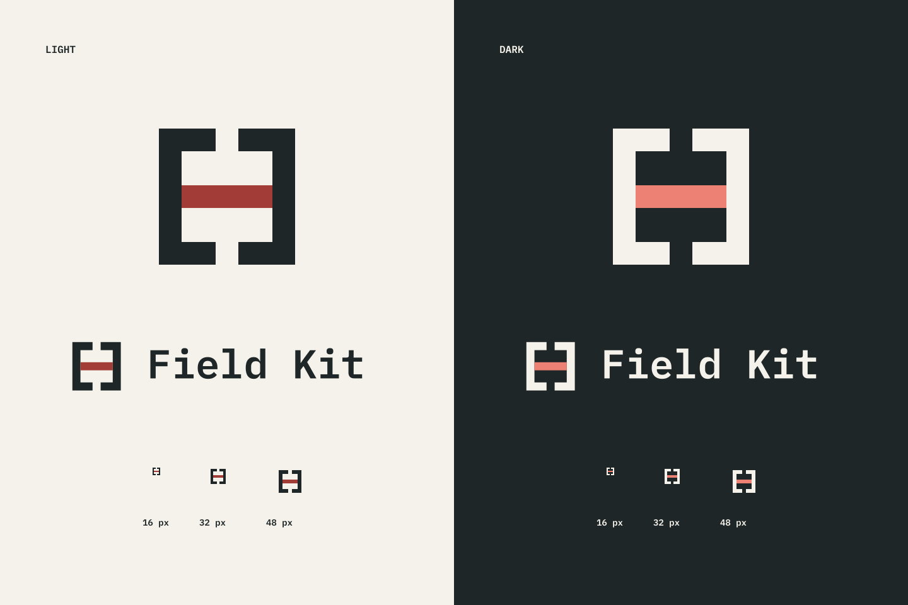

# Field Kit brand assets

Use **Field Kit** in headings, documentation and promotional copy. The repository
stays `fde-fieldkit`; the command, Python module and core package stay `fieldkit`.



## Ready to upload

| Use | Image | Size |
| --- | --- | --- |
| GitHub repository social preview | [github-social.png](github-social.png) | 1280 × 640 |
| Website link previews / Open Graph | [website-social.png](website-social.png) | 1200 × 630 |
| Portfolio or project card | [portfolio.png](portfolio.png) | 1600 × 900 |
| Square avatar or project icon | [avatar.png](avatar.png) | 1024 × 1024 |
| Transparent logo on light backgrounds | [logo.png](logo.png) · [SVG](logo.svg) | 1024 × 1024 |
| Transparent logo on dark backgrounds | [logo-reversed.png](logo-reversed.png) · [SVG](logo-reversed.svg) | 1024 × 1024 |
| Single-color logo | [logo-mono.png](logo-mono.png) · [SVG](logo-mono.svg) | 1024 × 1024 |
| Name and logo on light backgrounds | [wordmark.png](wordmark.png) · [SVG](wordmark.svg) | 1288 × 256 |
| Name and logo on dark backgrounds | [wordmark-reversed.png](wordmark-reversed.png) · [SVG](wordmark-reversed.svg) | 1288 × 256 |
| Small icons | [16 px](logo-16.png) · [32 px](logo-32.png) · [48 px](logo-48.png) | Square |

Social and portfolio cards also have editable, self-contained SVG versions:
[GitHub](github-social.svg), [website](website-social.svg) and
[portfolio](portfolio.svg). The lettering is outlined, so these exports do not
require installed fonts. PNGs have no embedded personal metadata.

For GitHub, upload `github-social.png` in **Repository Settings → General →
Social preview → Edit**. It is under 1 MB and uses GitHub's recommended
[1280 × 640 dimensions](https://docs.github.com/en/repositories/managing-your-repositorys-settings-and-features/customizing-your-repository/customizing-your-repositorys-social-media-preview).
Committing the file does not change that repository setting automatically.
The website uses `site/assets/og.png` for link previews. Platforms may cache an
older image until they refresh it.

## Using the identity

- Keep the name as two words: **Field Kit**.
- Use the primary logo on light backgrounds and the reversed version on dark
  backgrounds. The monochrome version is for single-ink printing or engraving.
- Keep the SVG's built-in clear space; don't stretch, rotate or add a frame,
  shadow, texture or gradient. Keep extra content outside that space.
- The standalone mark is designed for 16 px and up. Use a wordmark at 161 px
  wide or larger, with enough contrast to read the name.
- Pair the product with accurate copy: **Eight local tools for data, drafts and
  AI workloads.** For network and installation details, link to the [README](../README.md).
- These cards are brand artwork. Real application screenshots remain in
  [`site/assets/screenshots/`](../site/assets/screenshots/README.md).

| Color | Hex | Use |
| --- | --- | --- |
| Ink | `#1e2628` | Primary mark and text |
| Paper | `#f4f2ea` | Light surfaces and reversed mark |
| Brick | `#a13d36` | Primary central slide |
| Coral | `#ed8274` | Central slide on dark backgrounds |

## Source and reproduction

The original caliper's opposed jaws and central slide remain the recognition
hook. The enclosing tile, outlines, bevels and small mechanical details are
removed. The final mark is two filled paths, with identical geometry in every
color variant. It was drawn as SVG, not traced from a bitmap. The
[original reference](references/source-caliper.png),
[image-generation study](references/minimal-study.png) and
[five-line brief and study prompt](references/brief.md) document the lineage;
use the final assets above for publication.

The SVGs are the editable source. To regenerate PNGs and copy the canonical
mark, wordmark and social card into the website, run from the repository root:

```sh
python3 scripts/build_brand.py
```

Exporting requires `rsvg-convert` from librsvg. Using the committed files does
not require it. No runtime dependency is added to Field Kit. After editing SVG
source, inspect the small icons and both backgrounds before committing exports.

Wordmark and card lettering derives from the repository's self-hosted IBM Plex
Mono and Sans fonts, with the [SIL Open Font License](../site/fonts/OFL.txt)
and [font provenance](../site/fonts/README.md) preserved. Original project artwork
is distributed under the repository's [MIT license](../LICENSE).
